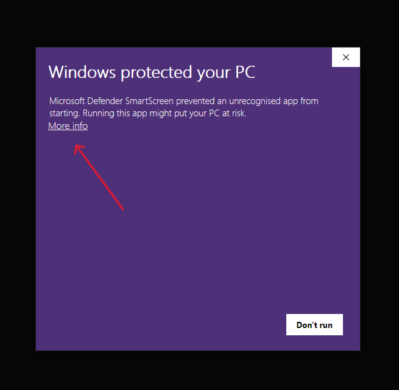
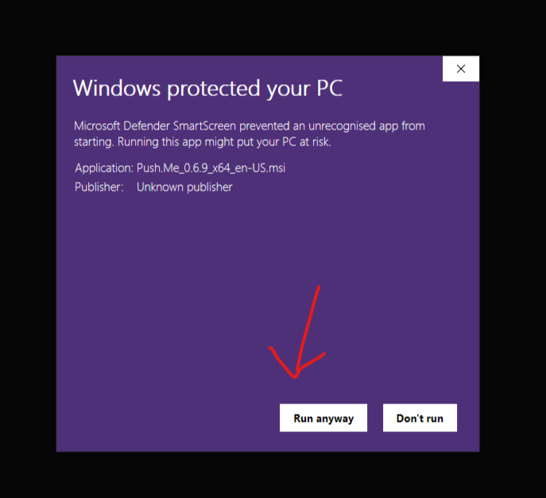

# Push Me

"Push Me" is a straightforward break app designed to promote a healthier work routine. This lightweight application sends gentle reminders to encourage regular breaks and is customizable to your preferences. With a user-friendly interface and seamless integration across devices, "Push Me" helps you optimise productivity, boost focus, and maintain a balanced work-life dynamic. Take control of your well-being—download "Push Me" now and make breaks a productive part of your day!

## Get started

You can download the app from this URL: [Download link](https://github.com/snowin-jj/push-me/releases/latest)

## Installation

I don't have a certified licence to publish the app to the Microsoft Store or Apple Store.

So, follow the steps below if you see this dialogue.

### On Windows

Step 1

Step 2

